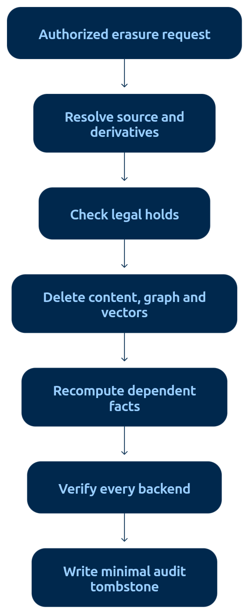

# Palimnex retention and cleanup



Palimnex implements a conservative local retention and authorized-erasure
profile. Documentation is design and operating guidance; it never grants
execution permission. Installation and testing do not activate a live policy,
migrate a ledger, delete records, publish Git state, or authorize external
actions.

The previously accepted v2.5 plus additive memory capabilities remain accepted.
Historical exception `PM-ACCEPT-001` named a noncritical retrieval miss on the
prior atomic-swap corpus; it does not apply to this repository's frozen
evaluation, which reports 20/20 cases and Recall@5 `1.0`. This document covers
new retention controls and physical cleanup separately. Do not treat a sub-1.0
frozen MRR on this corpus as a retrieval miss or as a passing-test relabel of
that old exception. See `docs/DESIGN.md` section 10.

## Repository profile

The repository stores typed SQLite events with `volatile`, `session`, or
`durable` retention, explicit evidence, supersession and contradiction edges,
promotions, workflows, sessions, and projection outbox rows. It does not store
the specification's subject/predicate/value fact model. The legacy event
ledger has no event hash chain. The new retention control audit can hash-chain
its own actions without retroactively authenticating legacy events.
Its logical digest is the implementation's typed canonical row-framed local
status digest, including the new control chain, not the `logical_document`
export digest or the specification's hypothetical chain-tip formula. Rebuilding identical
logical contents must preserve that digest; forgetting must change it.

Packs are authenticated and encrypted using the existing pack format. They
are not signed custody certificates. Shared-key authentication does not prove
sender identity. No code or document in this slice turns an imported pack into
trusted instructions or restores historical authorization.

The supported profile is manual and uses transaction/observation time
(`tx_at`). Rules match the actual retention enum and event kind. Durable and
imported records never become eligible through TTL rules or an unscoped plan.
They require a short-lived, per-event authorization naming the active policy,
a pseudonymous authorizer, and an allowed machine reason code. Session start
and close events remain protected audit anchors. Unsupported classification
and unmatched rules retain records. The retention ledger uses a new schema profile and explicit migration; only
isolated-copy migration is exercised in this slice. Opening a legacy ledger
must not silently migrate it. No automatic scheduler, inferred environment-variable TTL,
`last_accessed_at` clock, unreviewed durable override, or
remote-store adapter is provided.

Preservation holds take precedence over expiry. An open session pins its
written events and explicitly pinned referenced event IDs. Recall with an
active `session_id` also pins returned event IDs in the same transaction; root
context assembly passes its active session through this path. Unscoped reads
do not infer a session. Closed sessions retain
those pins through configured grace. No heartbeat silently releases a pin.
Session anchors, control history, receipts, and deletion tombstones survive.
Anchor task/outcome payloads are scrubbed when a session member is erased.
Temporal chains are withdrawn together so deleting a correction cannot revive
its predecessor. Registered support sets use a documented `max` confidence
aggregation: after one source disappears, a fact remains only when another
source remains at or above its threshold; otherwise it is withdrawn.

## Two-phase control plane

An active, versioned policy decides eligibility. The deletion contract names
the supported erasure operation and derivative handling. A proposed plan is
an inspection artifact, never authority to execute its own contents. Apply
requires an explicit invocation and validates the active control state again.

Without an active policy, proposal returns a refused retain-all result with
no affected records and zero reclaimable bytes. Policy activation must be
explicit. Apply refuses unconfigured state. On an unmigrated legacy ledger, `cleanup-plan`
can return the unconfigured refused plan without performing migration. The
explicit-forget path is `retention-authorize` followed by a newly reviewed
digest-bound plan and apply; authorization itself never deletes anything.

The plan binds canonical ledger contents, policy specification, holds, session
pins, managed pack state, explicit authorizations, and derived support sets.
Its digest covers its canonical contents with
`plan_digest` omitted. An expired plan or any change to the bound world,
including release of a hold or closure of a session, requires a new proposal.
This profile uses `plan_digest` as plan identity; it has no separate externally
assigned plan ID or approval state. Millisecond timestamps are UTC epoch
values. Apply must recompute eligibility and compare the result, not trust a caller's
modified affected list or digest alone. Replaying a successfully applied plan
returns its original receipt; invalid plans never receive a partial retry.

Eligibility uses the first winning exclusion: unconfigured policy, hold,
session pin/grace, protected audit anchor, missing explicit authorization for
durable/imported content, not expired, dependency guard, then pack/cache
constraints. A plan enumerates affected records, per-store actions, excluded
records and reasons, dependencies, managed packs, and byte estimates.
Unadapted copies are caveats rather than fabricated acknowledgements.

## Erasure and recovery boundaries

Physical cleanup transactionally replaces eligible payloads with tombstones;
removes their evidence, verification attempts, promotions, workflows, lexical
terms and temporal relations; scrubs session prompts/outcomes; and rebuilds
the local graph from sanitized survivors. It retains only pseudonymous event
identifiers, HMAC record commitments, authorization/policy metadata, timestamps,
store scope, verification state, counts, legal-hold exceptions, and control-chain
continuity. SQLite secure-delete, WAL checkpointing
and VACUUM complete the supported local compaction stage.
References to retained events, source evidence, workflow parents and steps,
supersessions, corrections, revocations, imported material, and managed packs
are resolved before activation. Deleting a correction cannot resurrect an
older fact because the temporal component is withdrawn as one unit. This profile refuses imports and restoration rather than implementing a
deleted-ID-aware import adapter.
A later observation requires a new event identity; old identities do not
become valid again because their payload is absent.

A keyed HMAC residue limits offline guessing without the key; it is not proof
that bytes were erased and is not an anonymous identifier. Receipt metadata
can still disclose event identity, timing, and operation. Keys, retained
receipts, and external copies remain part of the operator's privacy model.

SQLite free pages, WAL/SHM files, replacement staging, old generations, and
recovery artifacts are separate storage surfaces. A successful logical delete
is not a storage-erasure claim. Successful compaction removes deleted payload content
from the resulting database; it cannot prove forensic erasure from SSDs,
filesystem snapshots, offline backups, logs, or prior model contexts.

Source-cache data and durable-memory projections are different surfaces.
The supplied example lists caches as out of scope while its invariants demand
invalidation. This profile requires invalidation/acknowledgement for supported
memory-derived projections. It never clears unrelated repository-source
caches or another project's namespace. Unsupported caches and exported copies
must be listed as unresolved rather than silently counted as erased.

There is no distributed transaction across SQLite, Redis, and arbitrary pack
files. Implemented local locking and the SQLite transaction provide only the
specified local boundary; compaction is a subsequent stage. A failed store acknowledgement must remain visible;
a claim of global atomic erasure is not justified. Unknown or unverified pack
membership conservatively blocks affected deletion. Targets included in managed
packs remain blocked until an adapter can prove replacement or retirement; this
profile does not regenerate packs. Pack regeneration remains a future adapter capability, using the
existing authenticated/encrypted format without claims of resigning or
third-party identity. Externally copied packs cannot be erased by a local
command.

Cleanup byte figures distinguish logical payload bytes from actual filesystem
allocation and post-compaction estimates. Excluded records, retained receipts,
tombstones, digests, and unresolved copies contribute no reclaimable bytes.
No byte estimate is a forensic-erasure guarantee.

## Four-column delivery gate

| Artifact | Documentation | Testing | Rollback |
|---|---|---|---|
| Versioned policy, deletion contract, digest-bound proposal/apply, local control state | This profile and generated schemas; explicit supported and unsupported scope | Unconfigured retain-all; policy monotonicity; changed policy/ledger/hold/pins/pack refusal; tampered plan refusal | Source rollback preserves runtime; disable manual apply without deleting policy/history |
| Reference-safe transactional rewrite, compaction and deletion suppression | Receipt meaning, dependency rules, pack and recovery boundaries | Survivor integrity; no dangling references or resurrection; exclusion order; retry/crash and contention behavior; deletion canaries | Before final irreversible purge, explicitly named recovery artifacts; after purge, no silent restoration of deleted data |
| Repeated-session comparison harness | Scenario provenance, condition definitions, metrics and interpretation | Restarts, temporal ordering, corrections, expiry, holds, abstention, identical budgets; frozen existing fixtures unchanged | Remove generated isolated evaluation output; preserve source fixtures and live ledger |

Evidence must identify which rows have actually passed. A synthetic deterministic
harness establishes behavior of its scripted workloads; it does not establish
model-driven longitudinal task improvement, provider cost, or production
retention compliance. Held-out/model-backed evaluation requires its separately
recorded cohort, model, budget, scorer and execution evidence.

## Policy and contract examples

These documents are illustrative inputs. Creating a JSON file does not activate
its policy or authorize deletion. Put operational input/output artifacts under
the repository's ignored private runtime directory, not an indexed source path.
The companion JSON Schemas define this supported repository profile; the
external specification's referenced schemas/examples were not supplied and
are not claimed as imported or validated originals.

```json
{
  "schema": "project-memory:retention-policy:v1",
  "policy_id": "local-session-retention",
  "version": 1,
  "mode": "manual",
  "clock": "tx_at",
  "rules": [
    {"retention": "volatile", "kinds": ["task", "outcome"], "ttl_seconds": 2592000},
    {"retention": "session", "kinds": ["failure"], "ttl_seconds": 7776000}
  ],
  "grace_after_close_seconds": 86400,
  "plan_ttl_seconds": 3600
}
```

The 30-day and 90-day windows above are examples chosen explicitly in this
file, not application defaults. An empty rules list retains everything.
A record's existing durable retention cannot be weakened by a TTL rule.
Durable and imported events require a separate explicit authorization.

```json
{
  "schema": "project-memory:deletion-contract:v2",
  "mode": "forget",
  "digest_kind": "hmac-sha256",
  "keep_tombstone": true,
  "audit_residue": "non-reconstructive-hash-chained-tombstone",
  "derived_data": "recompute-or-withdraw",
  "caches": "require-verified-invalidation",
  "packs": "require-verified-retirement",
  "security_audit_log": "protected"
}
```

This contract supports payload forgetting with surviving audit metadata. It
does not mean `suppress`, `retract`, archive-only movement, or digest-free
purge. Corrections remain ordinary historical changes. HMAC key material must
never be included in the contract, plan, receipt, committed fixtures, or CLI
output.

## Conservative exclusions and operational limits

Evidence and verification payloads, temporal links, workflow specifications,
indexes, graph derivatives, and session prompt/outcome payloads are erased with
their parent. Durable/imported content needs explicit authorization; session
anchors and the retention-control audit stay protected. A previously
attempted hot projection excludes its event with `store_not_adapted`; migration
does not make the old Redis projection disappear. The retention profile refuses
hot projection publishing and consumption. This is a fail-closed supported
subset, not a claim of general distributed multi-store invalidation.

The plan lists compressed logical payload bytes. `recoverable_now` is zero and
`recoverable_after_compact` is null because actual physical reclaimed storage
is not reliably predicted. A null estimate must not be rendered as zero bytes
of residue. The profile does not expose the supplied specification's full
per-store estimate or approval-state machine.

Canonical rewrite and receipt recording occur in one SQLite transaction.
Compaction follows under the owner lock. If compaction has not completed,
receipt state remains `compaction_pending` and the explicit finalize operation
can resume it. A replay acknowledges the original receipt; it does not repeat
the forget. This separation is not a claim of all-or-nothing physical erasure.
A failure after committed logical deletion does not permit restoring the old
value to make the original plan appear atomic.

## CLI runbook for an isolated rehearsal

Run these commands only in the intended isolated checkout with its own private
ledger and source configuration. Copy the policy example to an ignored private
file and obtain the expected ledger digest from `ledger-status`. Migration and
activation are explicit writes; they are not necessary to inspect ordinary
source memory or to run the test harness.

```bash
python3 palimnex.py retention-status
python3 palimnex.py ledger-status
python3 palimnex.py retention-migrate --expected-digest EXPECTED_LOGICAL_DIGEST
python3 palimnex.py retention-activate PRIVATE_POLICY_JSON --actor operator --reason 'isolated rehearsal'
python3 palimnex.py retention-hold EVENT_ID --actor operator --reason 'preserve for review'
python3 palimnex.py retention-release HOLD_ID --actor operator --reason 'review complete'
python3 palimnex.py retention-pin SESSION_ID EVENT_ID
python3 palimnex.py retention-authorize EVENT_ID --authorized-by privacy-officer-7 --policy-id RETENTION_POLICY_ID --reason-code SOURCE_DELETED
python3 palimnex.py retention-support DERIVED_FACT_ID --source SOURCE_EVENT_ID=0.90 --source INDEPENDENT_SOURCE_ID=0.80 --threshold 0.75
python3 palimnex.py cleanup-plan --event EVENT_ID
```

Allowed imported-record reasons are `RETENTION_EXPIRED`, `SOURCE_DELETED`,
`SOURCE_SYNCHRONIZATION`, `PRIVACY_REQUEST`, and `LEGAL_ERASURE`. Locally
durable records accept only `AUTHORIZED_ERASURE`, `PRIVACY_REQUEST`, or
`LEGAL_ERASURE`. Authorizations expire within 24 hours, are bound into the
plan digest, and cannot target session audit anchors. Support confidence uses
the explicitly registered maximum remaining independent-source score; absence
of a qualifying source withdraws the derived fact.

Store the proposed plan in an ignored private file. Review every affected ID,
exclusion, dependency, pack and caveat. Supply the displayed plan digest
explicitly; the file is not an approval artifact. The key file contains exactly
32 private random bytes and is supplied by path, never inline on the command
line. Do not reuse a pack-encryption key as a forget key.

```bash
python3 palimnex.py cleanup-apply PRIVATE_PLAN_JSON --confirm-digest REVIEWED_PLAN_DIGEST --key-file PRIVATE_FORGET_KEY --actor operator --reason 'isolated expiry rehearsal'
python3 palimnex.py cleanup-finalize APPLIED_PLAN_DIGEST
python3 palimnex.py ledger-status
python3 palimnex.py evaluate-longitudinal
```

`cleanup-finalize` resumes local compaction for an already committed deletion
receipt; it is not a new deletion selector. Do not run the illustrative commands
against the live repository ledger as part of merely reading this runbook.

The retention policy, deletion-contract v2, cleanup-plan v2, and erasure-
tombstone schemas were checked with Draft 2020-12 validation against the
runtime policy, constant deletion contract, and generated unconfigured,
configured, and event-scoped plans on isolated temporary ledgers. Semantic
checks such as privacy scanning, digest recomputation, timestamp relationships,
current holds, and dependency eligibility remain runtime responsibilities.

## Code rollback boundary

Retention control state, deletion suppression, and tombstones survive ordinary
source changes. Stop memory clients before any code rollback. Rehearse the
selected Git operation on a separate copy and do not downgrade across the
retention migration marker unless the older reader is proven to preserve the
same suppression and audit semantics. Never delete a migration marker to force
compatibility. Runtime data rollback is not provided because it could revive
forgotten information.

## Implementation evidence and remaining boundary

The owner policy is now represented directly in the local control plane.
Targeted tests cover TTL cleanup, explicit durable authorization, imported
source deletion reasons, protected anchors, legal holds, support recomputation
and withdrawal, temporal-chain withdrawal, provenance/workflow/index cleanup,
non-content receipts, HMAC commitments, crash/retry behavior, managed-pack and
projected-cache refusal, stale-plan rejection, compaction, and downgrade/import
guards. Aggregate stable-source results are recorded in the closure handoff;
none of this evidence represents a live migration or live deletion.

The complete deterministic longitudinal replay remains structural evidence,
not model-backed scientific acceptance. Likewise, a successful local erasure
does not prove forensic deletion from SSDs, snapshots, unregistered copies,
external model contexts, or third-party systems. Registered packs and any
attempted hot projection fail closed until an adapter can verify retirement or
invalidation. This is the supported operational boundary, not a silently
successful distributed deletion claim.

The live repository ledger was not migrated, authorized, or cleaned. Git
publication, provider spending, deployment, and other external actions remain
separately controlled.
